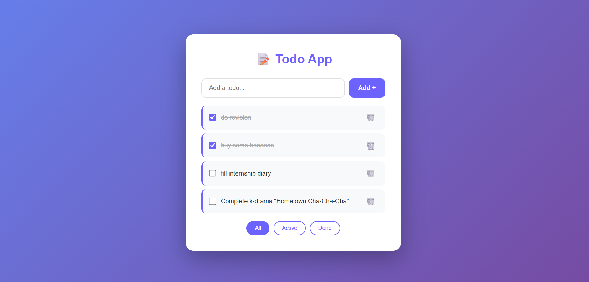
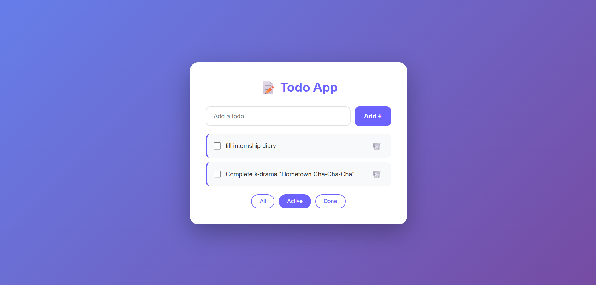
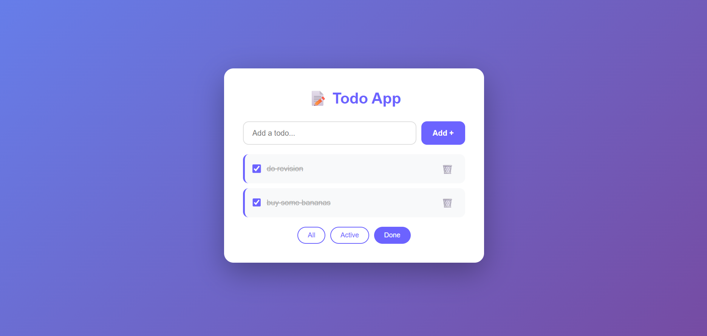

# ✅ Todo App

A responsive and beautifully designed Todo App built with React featuring a clean purple gradient UI.

## 🚀 Features

- Add new tasks instantly
- Mark tasks as complete with strikethrough
- Delete tasks
- Filter by All / Active / Done
- Beautiful purple gradient background
- Clean card UI design

## 🛠️ Tech Stack

- React.js
- CSS

## 📸 Screenshots

### All Tasks


### Active Tasks


### Done Tasks


## 🔧 How to Run

```bash
npm install
npm start
```

## 👩‍💻 Developer

**Aishwarya Hadagali**
- LinkedIn: [aishwarya-hadagali](https://www.linkedin.com/in/aishwarya-hadagali)
- GitHub: [aishwarya-hadagali](https://github.com/aishwarya-hadagali)
